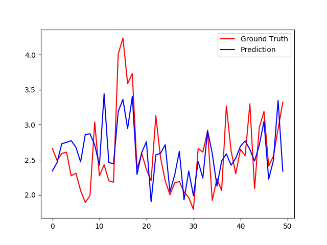

# Predicting Attractiveness using Computer Vision

## Traditional Machine Learning Approach   

#### Feature Generation
The features computation part of the pipeline requires the location of facial landmars of the input images. These landmarks can be generated by the [CLM-framework](https://github.com/TadasBaltrusaitis/CLM-framework). I have already included the landmarks localized using this framework in the data directory of this repo, and you can directly work with them. 

Example of extracting facial features: 


#### Example Usage

```shell
python trainModel -model linear_model -featuredim 20
```

The `-featuredim` argument specifies the number of components chosen by PCA which are how many dimensions to be reduced. 

After PCA, the `-model` argument is used to indicate the traditional machine learning models including Support Vector Machines (svm), Random Forests (rf), and Gaussian Process Regression (gpr). Checkout the source to change hyperparameters and other options. 

Analysis with Linear Regression: 




## Deep Learning Approach:

Details of the implementation can be found in the paper [`SCUT-FBP: A Benchmark Dataset for Facial Beauty Perception`](https://arxiv.org/pdf/1511.02459.pdf), the result of the creation and research on the dataset. 

#### Model:
Network architecture of our CNN for facial beauty prediction:


#### Results + Example Usage:

Sample visualized results from the prediction of models for audiences to compare. The blue block represents the human's rating and the green block represents the model's rating 


These pictures are celebrities in Vietnamese showbiz community and how their facial beauty were rated by our model. 


## What's included

```
face-rating/
├── data/
│   ├── ratings.txt
│   ├── landmarks.txt
│   ├── features_ALL.txt
├── source/
|   ├── machine_learning/    
│       ├── generateFeatures.py
│       ├── trainModel.py
│       ├── cross_validation.py
|   ├── deep_learning/    
│       ├── build_model.py
│       ├── utils.py
│       ├── face_rating.ipynb
|   ├── deeplearning_result.ipynb
|   ├── traditional_result.ipynb
```

### Requirements
- Python 2.7
- numpy 
- pandas
- scikit-learn
- keras
- tensorflow

### Dataset
The [SCUT-FBP](http://www.hcii-lab.net/data/SCUT-FBP/EN/introduce.html) dataset has been used. Please cite their research if you happen to use this dataset. The facial landmarks computer on this particular dataset are available in the `data/` directory. 

### License
MIT
